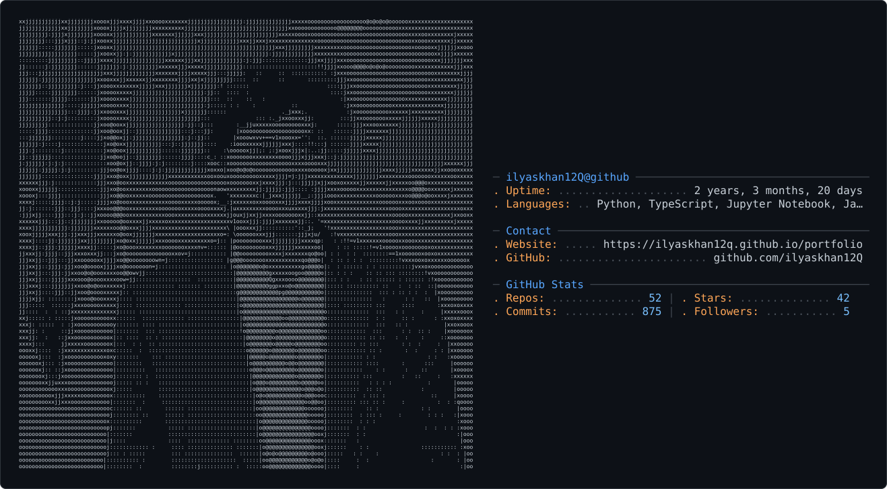

<picture>
  <source media="(prefers-color-scheme: dark)" srcset="dark_mode.svg" />
  <source media="(prefers-color-scheme: light)" srcset="light_mode.svg" />
  
</picture>

# Ilyas Khan

---

## About Me

- **Full Stack Developer** specializing in Python, TypeScript, and Jupyter Notebook
- Passionate about building scalable web applications and data-driven solutions
- Currently exploring AI/ML integration in web development
- Open to collaborations and new opportunities

---

## Tech Stack

  
  
  
  
  
  

  
  
  
  
  
  

---

## GitHub Stats

  
  

  

---

## 🤝 Connect

  
  
  
  

---

  <i>"Like the imaginary number i, I solve problems beyond the real axis—and I keep growing toward ∞."</i>

  

